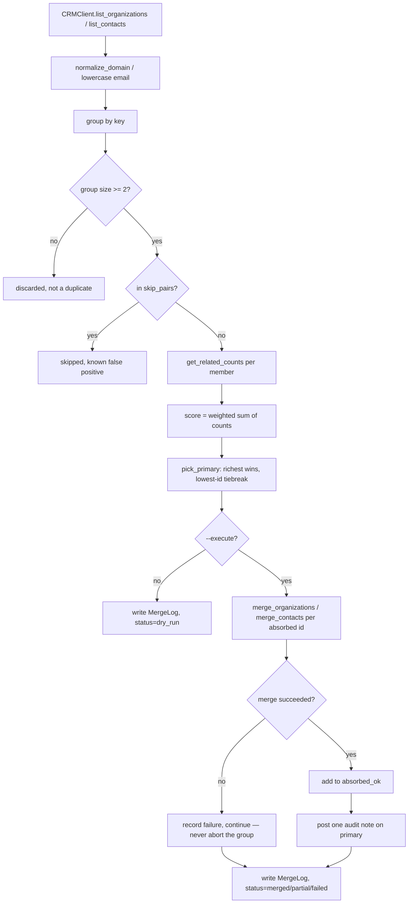

# Architecture

## Overview

The toolkit finds and safely merges duplicate CRM records in three stages:
**discover** (group candidates by a normalized key), **score** (pick which
member of each group survives), and **merge** (actually combine them, with
an audit trail). Every mutating step is dry-run by default — nothing is
written to the CRM unless `--execute` is passed explicitly.

## Data flow

## Components

- **`crm/base.py`** — the `CRMClient` interface every backend implements:
  list organizations/contacts, get related-record counts, native merge for
  both entity types, post an audit note.
- **`crm/sandbox_client.py`** — zero-network default backend, seeded with
  real duplicate groups so `discover`/`--execute` have something genuine to
  find and merge without any credentials.
- **`crm/pipedrive_client.py`** — a real Pipedrive API v1 implementation.
  Honest about its own limitations (no native `notes_count` field, no live
  account tested against in this project) rather than hiding them.
- **`dedup.py`** — pure logic, no I/O: key normalization, grouping,
  `skip_pairs` filtering, scoring, primary selection. Fully unit-testable
  without a database or network.
- **`pipeline/discover.py`** — orchestrates the CRM client and `dedup.py`
  into one run: dry-run by default, `execute=True` actually merges.

## Design decisions worth explaining

- **Re-verification is the merge call itself, not a separate pre-check.**
  Both CRM backends raise when a source record is already gone (merged by
  someone else since the plan was made). Catching that at the merge call is
  the re-verification checkpoint — a redundant separate "does it still
  exist" check would just be the same information fetched twice.
- **A failure on one group member never aborts the group.** If 3 of 5
  duplicates merge cleanly and 2 fail, that's `status=partial` with 3
  recorded as absorbed, not a rolled-back no-op.
- **Score-based primary selection, one formula for both entity types.** A
  weighted sum of linked-record counts (contacts, deals, notes, open
  activities) — the richest record survives a merge, not "lowest id" or
  "most recently touched."
- **`skip_pairs` is data, not code.** Known false positives (a shared
  mailbox, an ambiguous same-key pair) are listed in `config/rules.yaml`
  and consulted by the matching logic, not hand-written as special cases
  inside `dedup.py`.

## What this deliberately does NOT do

- No scheduled/automated merging — `discover --execute` is a command you
  run, not a background job. Duplicate merging is high-stakes enough to
  warrant a human deciding when to run it.
- No fuzzy/partial-name matching — only exact-key duplicates (same
  normalized domain, same email) are found automatically. Partial variants
  need a human to catch, same as the reference system this was informed by.
